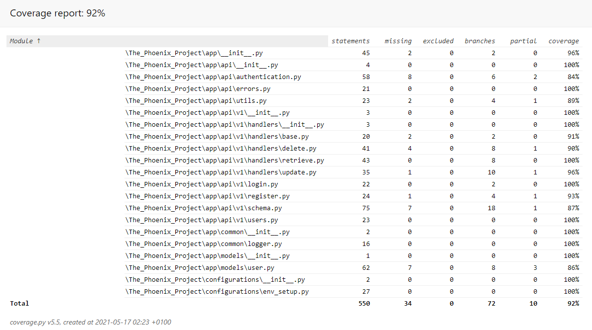
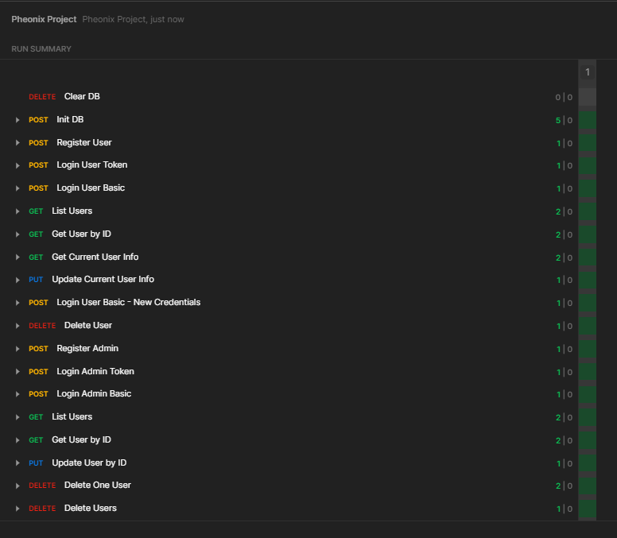
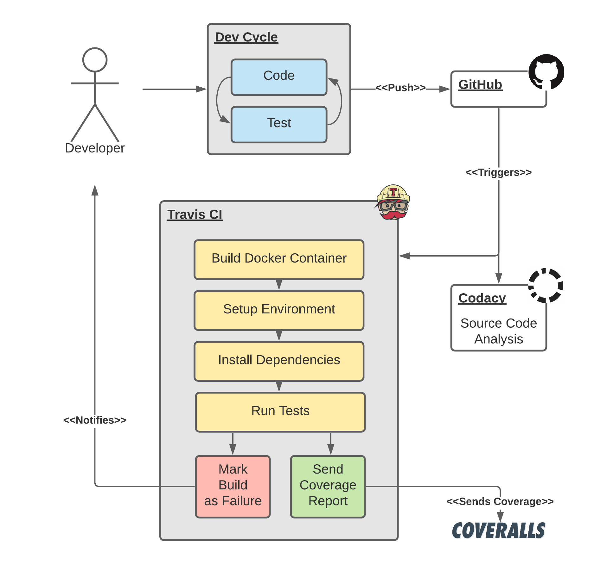

# The_Phoenix_Project

> A stepping stone codebase to  working on "The Unicorn Project". 
> ([1](https://www.amazon.co.uk/Unicorn-Project-Developers-Disruption-Thriving-ebook/dp/B07QT9QR41), 
> [2](https://www.amazon.co.uk/Phoenix-Project-DevOps-Helping-Business/dp/0988262509))

[](https://travis-ci.com/DavidWalshe93/The_Phoenix_Project)
[](https://coveralls.io/github/DavidWalshe93/The_Phoenix_Project?branch=main)
[](https://www.codacy.com/gh/DavidWalshe93/The_Phoenix_Project/dashboard?utm_source=github.com&amp;utm_medium=referral&amp;utm_content=DavidWalshe93/The_Phoenix_Project&amp;utm_campaign=Badge_Grade)
[](https://opensource.org/licenses/MIT)

## Table of Contents

- [Requirements](#requirements)
- [Quickstart Guide](#quickstart-guide)
- [Brief](#brief)
- [Application](#application)
    - [Summary](#summary)
    - [Endpoints](#endpoints)
- [Testing](#testing)
- [CICD Pipeline](#cicd-pipeline)
- [Future Work](#future-work)
- [References](#technical-references)

## Requirements

- Python3.7 or higher
- SQLite

Python3.7 is the lowest supported version due to heavy usage of Python 3.7's 
[dataclasses](https://docs.python.org/3/library/dataclasses.html) feature to improve
code readability and self-documentation of data structures. If back porting was a requirement,
they could be refactored out to use the [NamedTuple](https://docs.python.org/3/library/typing.html#typing.NamedTuple) class 
or [namedtuple](https://docs.python.org/3/library/collections.html#collections.namedtuple) collection objects instead. Use of a 
3rd party library such as [attrs](https://www.attrs.org/en/stable/index.html) is also an alternative. 

## Quickstart Guide

1) Clone the code.

    ````shell
    git clone https://github.com/DavidWalshe93/The_Phoenix_Project.git
    ````

2) Navigate to the root directory of the project:

    ````shell
    cd <PATH_TO_DIR>/The_Phoenix_Project/
    ````

3) Create a virtual environment

    ````shell
    python3 -m venv venv
    ````
   
4) Activate the virtual environment

    ````shell
    source ./venv/bin/activate
    ````

5) Install requirements

    ````shell
    pip install -r requirements.txt
    ````

6) Setup ENV Variables

    ```shell
    # Sources Flask application ENV variables.
    source dev_setup.sh
    # Key used for password hashing.
    export SECRET_KEY="abc"
    # Key used for registering as an ADMIN.
    export ADMIN_SECRET_KEY="XYZ"
    ```

7) Run Tests

    ````shell
    pytest
    ````

8) Run Dev Server

    ````shell
    flask run
    ````

## Brief

- Create, Update, Delete and List web service endpoints for a User object.
- User object should contain a name, email address, password and the date of their last login.
- Provide a login endpoint that validates the email address and password provided by the user matches the one stored in
  the database

## Application

Below are some thoughts behind why the application stack was chosen.

### Summary

| Component             | Framework/Library          | Why                                                                                                                      |
|-----------------------|----------------------------|--------------------------------------------------------------------------------------------------------------------------|
| Python                | --                         | Most experience with.                                                                                                    |
| API                   | Flask/FlaskRESTful         | Rapid prototyping with large eco-system of feature plugins.                                                              |
| Database              | SQLite                     | Good for prototyping and fast dev-test cycle with in-memory functionality, ideal for repeatable unit/functional testing. |
| ORM                   | SQLAlchemy                 | Easier to work with and faster turn around time than writing raw SQL. Better code readability.                           |
| DTO/Schema            | Marshmallow                | Easy transfer of database objects/Request bodies into various data-structures including Dicts/Dataclasses/Namespaces.    |
| Login/Role Management | FlaskHTTPAuth              | Supplies a simple role based system out-of-the-box, protects endpoints using the intuitive decorator pattern.            |
| Token Access          | FlaskHTTPAuth/itsdangerous | Allows both Bearer Token and Basic Authentication.                                                                       |
| Password Hashing      | Werkzeug                   | Clear interface for hashing passwords before saving to database and for verifying hashed passwords on login attempts.    |

### Endpoints

Below are the endpoints for the given application.

| Endpoint            | Method | Auth | Action                                                                        |
|---------------------|--------|:----:|-------------------------------------------------------------------------------|
| /api/v1/register    | POST   |   🔴  | Registers a new user/admin with the system.                                   |
| /api/v1/login       | POST   |   🔴  | Login an existing user.                                                       |
| /api/v1/users       | GET    |   🔵  | List all user's usernames and last login timestamp.                           |
| /api/v1/users/me    | GET    |   🔵  | Get the current user's information. (email, username, last login)             |
| /api/v1/users/me    | PUT    |   🔵  | Update the current user's username and/or password.                           |
| /api/v1/users/me    | DELETE |   🔵  | Close the current user's account.                                             |
| /api/v1/users/<:id> | GET    |   🔵  | Get a single user's id, username and last login from their ID.                |
| /api/v1/users/<:id> | GET    |   🟢  | Get a single user's id, username, email, role and last login, given their ID. |
| /api/v1/users/<:id> | PUT    |   🟢  | Update a single user's username and/or password based on their ID.            |
| /api/v1/users/<:id> | DELETE |   🟢  | Delete a single user based on their ID.                                       |
| /api/v1/users       | GET    |   🟢  | Get all user's usernames, emails and last login timestamps.                   |
| /api/v1/users       | DELETE |   🟢  | Delete a group of users based on a list of ID's                               |

#### Access Rights

| Role       | Access Level | Description                                                |   
|------------|:--------------:|----------------------------------------------------------|
| Anonyomous |       🔴      | Non-logged in user.                                       |                                               
| User       |       🔵      | Logged in user with User privileges.                      |
| Admin      |       🟢      | Logged in user with Admin privileges.                    |

## Testing

### PyTest

Testing was carried out using the PyTest framework with 43 tests created in total.

Pytest was chosen over unittest/nosetest for its expressive syntax and powerful fixture injection features, greatly
reducing boilerplate code.

The image below depicts the granular coverage report for the delivered application.



### Postman

Postman was also used to test against a development instance of the application during development. The exported Postman
project can be found in the ./postman directory.

To improve repeatability, two helper requests were setup to clear the development application's database and then
initialise it with five users before running the rest of the request tests. This allowed requests to start from the same
state each test cycle.

The tests were written using Postman's Test API and the Pre/Post request hooks offered by Postman.



## CICD Pipeline

A simple CI/CD flow is created to showcase understanding of core DevOps fundamentals and to keep code honest outside the
original development environment.

### Components

| Component             |  Service  | Links                                                                                                                                                                                                                                                                                                |
|-----------------------|:---------:|------------------------------------------------------------------------------------------------------------------------------------------------------------------------------------------------------------------------------------------------------------------------------------------------------|
| SCM                   |   GitHub  |                                                                                                                                                                                                                                                                                                      |
| Build Agent           | Travis CI | []( https://travis-ci.com/DavidWalshe93/The_Phoenix_Project )                                                                                                                                                |
| Coverage Analysis     | Coveralls | []( https://coveralls.io/github/DavidWalshe93/The_Phoenix_Project?branch=main )                                                                                                         |
| Code Quality Analysis |   Codacy  | []( https://www.codacy.com/gh/DavidWalshe93/The_Phoenix_Project/dashboard?utm_source=github.com&amp;utm_medium=referral&amp;utm_content=DavidWalshe93/The_Phoenix_Project&amp;utm_campaign=Badge_Grade ) |

### Pipeline Architecture



## Future Work

Due to timing constraints, some aspects of the project were not fully realised, this section is supplied to highlight
where additional time would have been spent.

- ❗ Continue to improve test coverage.
    - Add tox to check against multiple versions of Python.    
    - Add additional unittesting to validate rarely activated code paths.
- ❗ Add additional endpoint, allowing admins to create a User.
- ❗ Add Docker support for better test/deployment support.

    - ✔️Semi-realised by Travis CI, which builds a docker container to run tests on, ensuring no hidden dependencies are
      on local machine

- ❗ Deploy to PaaS provider such as Digital Ocean or Heroku or a CSP such as AWS or Azure.

## Technical References

- [Flask Web Development, 2nd Edition by Miguel Grinberg](https://learning.oreilly.com/library/view/flask-web-development/9781491991725/)
- [miguelgrinberg.com](https://blog.miguelgrinberg.com/)
- [Python Testing with pytest](https://learning.oreilly.com/library/view/python-testing-with/9781680502848/)
- [Marshmallow](https://marshmallow.readthedocs.io/en/latest/)
- [FlaskHTTPAuth](https://flask-httpauth.readthedocs.io/en/latest/)
- Stack Overflow

